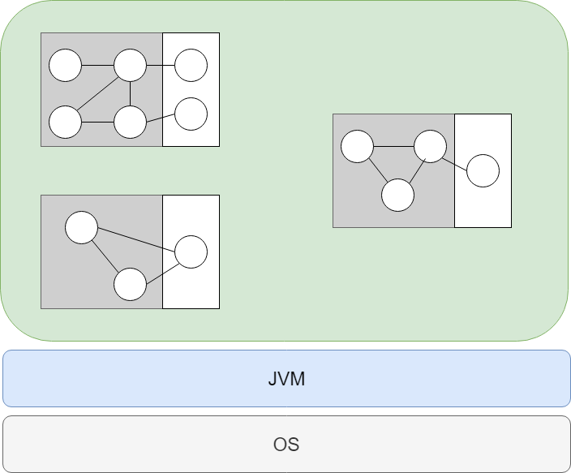
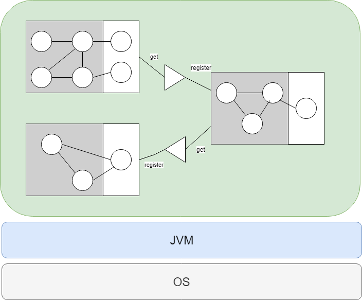

The question "What is OSGi" is frightingly asked very often on the internet or used as the title of blog posts / videos that try to explain it [[1]][1] [[2]][2] [[3]][3] (Just for fun I should have added a link to this post, but ... nah).
When I began to deep-dive into the mysteries of the beautyful and sometimes scary world of OSGi, I myself asked this question very often and got answers similar to those given by the posts/videos mentioned above.
However, having been an advanced Java novice at that time I couldn't make much sense out of most of those answers, probably because I didn't yet have the pleasure to encounter the problems that OSGi was set out to solve.

So here it is: My personal interpretation of an answer to the question: "What is OSGi". It is a little bit shifted to be an answer for someone who is a passable Java developer but has not yet had the pleasure to run into problems that come with large Java projects eventually.

Therefore I rephrase the question to: ***"What is OSGi from a passable Java developer's point of view?"***

## TLDR

OSGi is a fancy framework on top of the JVM that
* gives you tools to create modules in Java (and calls them bundles)
* gives you tools to enable inter-module communication (spoiler alert: services)
* gives you a well-defined lifecycle for modules to hook into, wich...
* ... enables you to add/remove/replace those modules at runtime
* therefore helps you to create best-practice modular software in Java

That's great because
* you create Moduliths instead of spaghetti code
* you can evolve your applicatin over time mostly by adding new modules
* you can easily change implementation details of modules as they are well-encapsulated
* it's like microservices for the JVM without the headaches of a distributed system

## The long story

When you are writing a plain old Java application with no help from an additional framework (btw. frameworks are not APIs/libraries, so APIs/libraries are allowed ;) ) you usually start with your `main` method somewhere.
From there on you create classes, interfaces, enums and all the fancy stuff that is delivered to you by the programming language. 
If you have read some books about software patterns, then you even might add some of those to your codebase to adhere to some of the most basic principles of software engineering, like:
* encapsulation
* high cohesion
* low coupling
* separation of concerns
* ...

At the end of the day you will then end up with a more or less well-structured code base that eventually runs on the JVM. 
The following picture thus shall be an abstract view of your application until now:


This looks ok, doesn't it? Well kind of. 

To see what's wrong with this picture you should understand what tools Java gives you to structure your code, which are basically classes and interfaces with their variables and methods... and some visibility modifiers (private, protected, public, default) you can use for those.

What can you do with those tools to structure your code?
Well, for instance you can hide member variables from being accessed from outside the class itself. 
The same goes for methods that are declared private. 
That's great, because we don't always want a possible other developer to mess around with the state of our class directly, but maybe through methods.
Other means of hiding stuff from the outside world (and those annoying other developers that seem to **want** to break our code) might be 
* hiding classes by making them only package visible (default modifier)
* hiding implementations behind interfaces, factories or facades

but basically that's it. 
Java does not give you any other means to structure your code (I'm only speaking about Java 8, Java 9 came with its own module system, but you have to judge for yourself if you regard it better or worse than OSGi ;) )
So what problems are there that you might run into when using those mechanisms only?

**First**: Imagine a newbe developer that sees your interface that you designed by heart and ... ignores it. Why not just instantiate the implementation, because, you know, he can! ... and because reasons -.-

**Second**: Imagine this developer to instantiate it directly via `new`. Now you have the hardest coupling ever.
Not being able to exchange implementations, because he didn't use an interface and additionally everytime you **want** to change the implementation you will have to do it by hand, replacing the class behind the `new` statement.

Sounds awful, doesn't it? Wouldn't it be nice to have means to prevent this from happening? 
Like, let's say a system that lets you declare classes or even packages to be private? 
Vice verca, others to be explicitly be public, like an interface to your implementation?

## OSGi to the rescue!

What Java offers for classes, methods and variables with its visibility modifiers, OSGi offers for packages of a JAR.
However, OSGi has its own naming, so JARs are called Bundles in OSGi speak and Bundles always have a manifest file that (among other things) define what packages of the Bundle are private and what packages are public.
At runtime the OSGi framework then takes this metdata in the manifest file to actually hide classes that are in private packages from other bundles that try to access them. 
This way OSGi provides you with a way to **really** hide your impementations from those annoying other developers that constantly try to access your implementation details. 
This can even be taken a step further. Aside from hiding your implementation you now can explicitly state what packages shall serve as an API for the rest of the classes hiding in your bundle, by declaring the API packages as public. 
Isnt' that great? Look at the picture below to see how awesome this is:



Now nobody but you can access and instantiate the implementation classes that you want to hide behind your super fancy API interfaces. 
You and you alone are the one who decides which implementation is used internally. 

But wait... how do you do that? At compile time you state that only a part of your bundle is visible to others. If you hide your implementation how the hell shall another developer instantiate and use it?
There is now no way that he can call `YourAPI api = new HiddenImplementation()`. If he does so OSGI will punish him with some nasty Exceptions, because you declared the implementation to be private in the first place.
So right now we have a bunch of bundles where, at compile time, you can declare private and public packages, that at runtime are visible or not to other bundles, but no way at runtime to create a running system, because no one but you can instantiate your implementation classes.

This is where OSGi's services and its service registry come into play.

The service registry is a fancy thing, that at runtime can be used to register and find services. 
So what are services?

Services are implementation classes that are instantiated, hidden behind an interface (e.g., one within your API packages), and registered at the service registry under this interface.
Imagine an implementation class `BullDog` and an interface `Dog`. `Dog` is placed in a public package of your bundle and `BullDog` in a private package. All you need to do now is something like this 

```java
Dog dog = new BullDog();
serviceRegistry.registerService(dog, Dog.class);
```

(Spoiler alert: in reality this code looks a little bit different ;) )

Now the service registry knows about your service and any other (hidden) implementation in another bundle can lookup this service via something like this 

```java 
Dog dog = serviceRegistry.getService(Dog.class);
```

This is awesome for two simple reasons: 
* First, the annoying developer of that other bundle is **forced** to use the API you defined in your bundle, because if he tries instead to use an implementation class he simply will be punished by OSGi with a nasty exception.
* Second, **you** decide which implementation is used behind this interface and you can change it whenever you want. As the other developer is forced to use the interface he will not notice when you swap implementations behind the scene.

Although these concepts might seem super simple to you (and, well, somehow they are super simple), they are still tremendously powerful. 
By using this pattern of hiding implementations, publishing well-designed interfaces and only communicating indirectly over a broker (i.e., the service registry) you implicitly follow some of the most important principles in software engineering:
* You **encapsulate** the code that belongs to one functionality within one bundle
* You **hide the implementation** behind a well defined interface
* A Consumer **is forced to use the API** instead of unintentionally using an implementation
* Classes within your bundles usually have **high cohesion** and between bundles there is **low coupling**

What we now finally ended up with is probably looking something like this:



A application where each bundle has a private and public section that contain classes and interfaces as well as services that are registered by one bundle and used by another bundle.
What a beautyful, modular application *sigh* :)


## Conclusion

The concepts presented to you in the sections above are on the one hand super simple, on the other super powerful.
They implicitly force you and others to adhere to best practices of software engineering while at the same time enabling you to create truly modular software that is better maintainable and also more robust than the usual spaghetti code.

However, the above menetioned concepts are only a glimpse of what OSGi has to offer.

Therefore, I will try to explain other things that might be necessary for you to know to easily write good OSGi applications in the future. Topics like

* the bundle lifecycle
* capabilities and requirements
* or why declarative services are so much cooler than the services you saw here

will hopefully follow as soon as I have enough spare time for other posts on OSGi.


[1]: https://www.quora.com/What-is-OSGi-and-its-purpose-in-simple-words
[2]: https://stackoverflow.com/questions/4578850/what-is-osgi-and-what-are-some-examples-of-its-use
[3]: https://vimeo.com/201054944