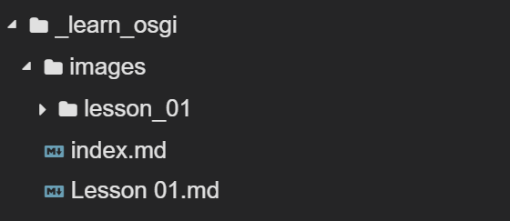

First of all: AWESOME that you decided to try and contribute to OSGi community by writing another great tutorial!

Second: We tried to make the process of contributing dead easy. The more difficult part is to create well structured content that fits into the rest of this site. 
Therefore, the majority of this page is dedicated to best practices we would like you to follow in order to create a well structured tutorial. 
But first things first.

If there is any problem that prevents you from getting started as described below, then don't hesitate to [open an issue](https://github.com/jatoms-io/io.jatoms.page/issues) :)

## Setup
There are just some simple steps to get started with contributing:
* Create a GitHub account if don't have one already.
* Go to the [GitHub repository of this site](https://github.com/jatoms-io/io.jatoms.page), scroll down and click the `Open in Gipod` button.
* Grant Gitpod access to your GitHub account and you are ready to go. 

After this you should see something like this:


Usually at this time the local server that serves the website should be started and you can start typing text.
If not, then click into the terminal at the bottom and type `bundle exec jekyll serve`, which starts the server.

### Setup for a new tutorial
In order to create your new tutorial, you need to follow these simple steps:
* Create a new markdown file like `Your Tutorial.md` in the `_learn_osgi/Tutorials/` folder.
* If you want to include images in your tutorial, then create a folder `your_tutorial` in the `_learn_osgi/Tutorials/` folder.
* Create a new repository in your GitHub account that will hold the code for your tutorial, name it `your-tutorial` and copy the contents of our [base OSGi tutorial repository](https://github.com/jatoms-io/io.jatoms.tutorial.base).

Below you can see how the structure looks like for lesson-01 of our OSGi tutorials and its picture folder as an example (ignore the index.md file):



The structure above has to be fulfilled as we try to create a folder structure that is easy to understand for future contributors.

The name of your tutorial markdown file will also be used for navigation cards within the `Tutorials` folder on the page, so you should think of a speaking title. 
The filename may contain whitespaces but must end with `.md` as it has to be a markdown file that will be processed by Jekyll, GitHub's static site generator.

The images you might want to include in your tutorial must be put in the created folder that is named after your tutorial. 
The name of this folder must be the exact same name as your tutorial title, but lowercased and with underscores in between words. 
Otherwise the paths to your images will not work in Jekyll (it seems Jekyll doesn't like whitespaces ;) ). 
So if your tutorial is name `My awesome tutorial.md` then your folder should be named `images/my_awesome_tutorial`.
The pictures you put into this folder must follow the same naming convention, i.g., `my-awesome_picture.png`.

The [base OSGi tutorial repository](https://github.com/jatoms-io/io.jatoms.tutorial.base) that you forked serves as a basis for all our OSGi tutorials and contains some basic settings that easen the process of writing OSGi applications in GitPod.
It also already comes with a readme that contains a GitPod button, that you should adopt to point to your repository instead of the base repository.

> TODO: create base OSGi tutorial repository and describe better what it contains

### Working with frontmatter and markdown
Until now you have created an empty markdown file for your tutorial and a folder that will contain the needed images. 
In order for your markdown file to get picked up properly by Jekyll you need to add frontmatter to your markdown file.
Therefore you should open your markdown file and add the following text to it at the beginning:

```
---
layout: content
description: Guidance on adding a new tutorial to this site, also some best practices
author: jatoms-io
published_at: 2020-01-02
order: 10
---
```

This is called frontmatter and is just a little bit of yaml that provides additional information about your markdown file.
* **layout**: mandatory, defines which layout should be used to display the written markdown content. For tutorials this should be `content`. Layouts are usually located in the `_layouts` folder if you want to have a look at them ;)
* **description**: mandatory if you want your tutorial to appear in the landingpage's news section, a short description of what this tutorial is about. 
* **author**: optional, this is your GitHub handle and is used to get your image to be added to the tutorial's card on the Tutorials page.
* **published_at**: mandatory if you want your tutorial to appear in the landingpage's news section. It's in the form year-month-date and should be updated each time you publish or change the tutorials content.
* **order**: optional, you can use this to order the tutorials. By convention you should use only two-digit steps, e.g., 10, 20, 30, so that you can later fit other tutorials in between 

The rest of the content is just plain markdown. 
We have created a cheatsheet on how to use markdown on this site which you can use as a reference: [Markdown Cheatsheet](../Layouts_and_Markdown/Markdown Cheatsheet)

## Best Practices 
The following subsections give you some guidance on how to write well structured tutorials and some best practices we would like to see followed in order to offer newcomers a unified experience.

### Structure of a tutorial
#### Abstract
Always write a short summary (only a few sentences)  of what will be done in this tutorial.

This helps readers to judge if the content of this tutorial is helpful for them or not.

#### Content
For the actual content there are some rules to follow so that the appearance for all tutorials is similar to one another:
* The content should be broken down into small steps 
* Each step 
    * has a corresponding level 2 heading in the document, i.e. in markdown use `##` and a short title 
    * has a corresponding branch in the corresponding tutorial repository 
    * is divided into three sections:
        * a section with a short list of actions that the reader needs to do to fulfill this step 
        * a (probably much longer) section with explanations of what each action does and what happens in the background
        * a short section with links to further reading material   


Why breaking down a tutorial in small steps?

Large tutorials usually lead to higher bounce rates with readers, as the usual span of attention gets smaller and smaller the younger the readers are.
Therefore we break down a large tutorial into small little chunks that are easier to overview and faster to fulfill. 
Small. little steps always seem easier than one giant leap.
In order to visually underline this structuring we use level 2 headings that will be displayed in the table of contents on the right side of a tutorial.

In order to make it as easy as possible for readers to follow the steps of a tutorial we also structure the repository that contains the accompanying code into several little steps.
We do this by offering a branch for each step. Ideally, the branch for te respective step is named the same, e.g., you named your step `lesson 02`, then the branch containing the status needed to work through this step is also called `lesson 02`

Each step is additionally broken down into 3 sections, as described above. 
The first section should only contain the minimal actions to be taken to fulfill this step without lengthy explanations, so that a reader gets to the result pretty quickly and doesn't need to scan through pages of text to find the action needed for this step.
This has two reasons:
* A novice quickly makes progress and is rewarded, thus he probably is higher motivated to read further or to do the next step 
* An expert that only wants to refresh his memories of what exact actions need to be taken to achieve XY always has a good summary without scanning the whole text.

The next section is the actual content, the why and how the actions described before do work. 
This is the place where you should go into detail, explaining why you did this or that action and what is happening behind the curtains that the reader should know about.
In this section you should refrain from linking to other pages, websites or even secitons in this document, otherwise you risk your reader to get lost in hyperspace.

The right place to provide this further reading is the third section which should only contain links and reading recommendations, best with some additional explanation why the respective resource is worth a read or when to read it.

To sum it up:
* First talk about the **WHAT**, what to do, what result is expected
* Then talk about the **WHY** and **HOW**, why do you need to do it this way and how does it work 
* Finally provide further reading for topics that would be too much for your tutorial 

#### Conclusion
A short summary of what you've explained and what will be done in the next step.

This is like binge watching on Netflix but with tutorials. Provide your reader with a short description of the knowledge you will teach him in the next step, a knowledge cliffhanger so to speak ;)

### Gitpod 
The corresponding repository of the tuturial must be executable in gitpod, so that a reader can execute it without the need to setup everything on its own machine.

This setup is mandatory as we want to provide a hassle-free onboarding experience for newcomers. There is nothing worse than a tutorial that is not working although one did the same exact things as described by the author.
By providing a reproducible developer workspace with GitPod we reduce the risk to loose newcomers due to not working tutorials.
Also in order to fix bugs this setup is ideal, as a user can provide the author of a tutorial with a snapshot of the workspace in the state that produced a non-expected behavior.

### Draw.io
Diagrams and similar stuff should be done with draw.io in order to be reproducible and editable in the future

We all know that the only constant is change. So when we need to change some diagrams in a tutorial it would be pretty cumbersome to reprdouce the drawings, one author once made, each time over again.
Therefore we would like you to use draw.io as those files can be checked into GitHub and therefore be used whenever we need to change a diagram.
Draw.io provides integration with Github, so you can easily open the Gitpod for this website and Draw.io side by side to edit diagrams and text alike and then commit both together. just don't forget to do a `git pull` each time you changed and commited a diagram.