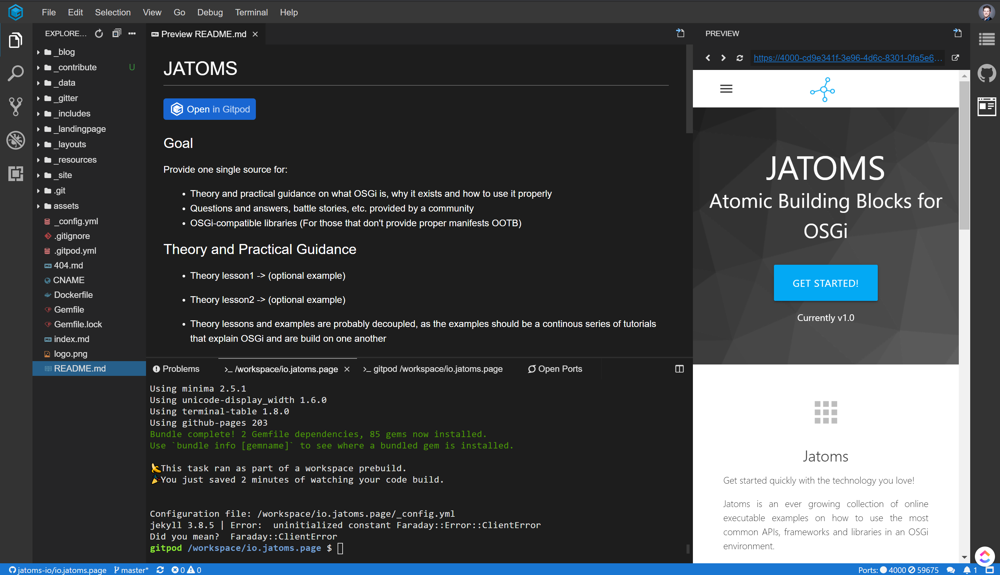
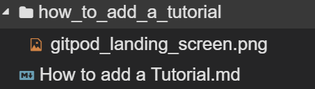

First of all: AWESOME that you decided to try and contribute to OSGi community by writing another great tutorial!

Second: We tried to make the process of contributing dead easy. The more difficult part is to create well structured content that fits into the rest of this site. 
Therefore, the majority of this page is dedicated to best practices we would like you to follow in order to create a well structured tutorial. 
But first things first.

## Setup
First you need a GitHub account, then you go to the [GitHub repository of this site](https://github.com/jatoms-io/io.jatoms.page) scroll down a little bit until you see the "Open in Gipod" button and click on it.
If you never used Gitpod before, then you might need to grant Gitpod access to your GitHub account. 
After this you should see something like this:



Usually at this time the local server that serves the website should be started and you are ready to go.
If not, then click into the terminal at the bottom and type `bundle exec jekyll serve`, which starts the server.

If there is any problem that prevents you from getting started as described, then don't hesitate to [open an issue](https://github.com/jatoms-io/io.jatoms.page/issues) :)

### Create a new tutorial page
Tutorials are located under `_resources/Tutorials/<tutorialname>.md`.
Each tutorial is a seperate markdown file, so for you to get started with your own tutorial the first step is to create a new markdown file named after the title you chose for your tutorial, e.g., the file of this page is named `How to add a Tutorial.md`. 
The ending `.md` marks it as a markdown file.
The images you might want to include in your tutorial are located under `_resources/Tutorials/<tutorialname_lowercase_with_underscores>/<your_image>.png`
So the next thing you do (if you have any images) is to create a folder that is named like your tutorial, but lowercased with underscores in between words, e.g., the image folder for this document is named `how_to_add_a_tutorial`
Images within this folder should also be named lowercase with underscores in between words and be saved as .png files.

Below you can see how this structure looks like for this document:



### Working with frontmatter and markdown
Until now you have created an empty markdown file for your tutorial and a folder that will contain the needed images. In order for your markdown file to get picked up properly by Jekyll (the static site generator used to create this website) you need to add so called frontmatter to your markdown file.
Therefore you should open your markdown file and add the following text to it at the beginning:

```
---
layout: content
description: Guidance on adding a new tutorial to this site, also some best practices
author: jatoms-io
published_at: 02-01-2020
order: 10
---
```

This is called frontmatter and is just a little bit of yaml that provides additional information about your markdown file.
* **layout**: mandatory, defines which layout should be used to display the written markdown content. For tutorials this should be `content`. Layouts are usually located in the `_layouts` folder if you want to have a look at them ;)
* **description**: mandatory if you want your tutorial to appear in the landingpage's news section, a short description of what this tutorial is about. 
* **author**: optional, this is your GitHub handle and is used to get your image to be added to the tutorial's card on the Tutorials page.
* **published_at**: mandatory if you want your tutorial to appear in the landingpage's news section. It's in the form day-month-year and should be updated each time you publish or change the tutorials content.
* **order**: optional, you can use this to order the tutorials. By convention you should use only two-digit steps, e.g., 10, 20, 30, so that you can later fit other tutorials in between 

The rest of the content is just plain markdown. 
We have created a cheatsheet on how to use markdown on this site which you can use as a reference: [Markdown Cheatsheet](../Layouts_and_Markdown/Markdown Cheatsheet)

### Create tutorial workspace
TODO ....

## Best Practices 

### Structure of a tutorial
#### Abstract
A short overview of what will be done in this tutorial
#### Content 
* Content should be broken down into short steps
* Steps start with a practical short description of what is needed to be done to fulfill this step 
* After this short description a detailed look back on what you did and what happened in the background is given.
* Background knowledge, e.g., how maven works or something similar, should be created seperately in the Theory folder, marked as such and should provide a link to it.
* Each step should have a corresponding branch in the tutorial's GitHub repository 
* Each step should be a Level 2 heading (##) in the document 
* Each step should have no links within the text, but only at the and of it (better reading flow, less distraction)
#### Conclusion
A short summary of what you've explained and where to get more information
### Gitpod 
The corresponding repository of the tuturial must be executable in gitpod, so that a reader can execute it without the need to setup everything on its own machine.
### Draw.io
Diagrams and similar stuff must be done with draw.io in order to be reproducible and editable in the future
