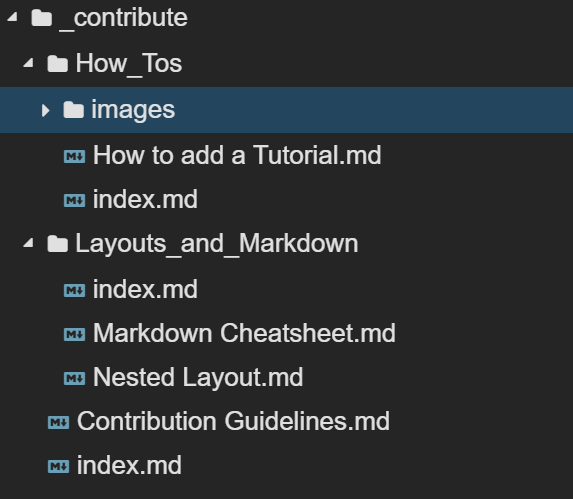

## Nested Layout
Most Jekyll templates, as awesome as they are, usually don't support a nested folder hierarchy, i.e., it is not possible to structure your content hierarchically and let this structure be reflected by the generated website.

For this we wrote the `nested` layout that can be used on `index.md` markdown files that should serve as an index to the files that are within a folder.

The front matter you need for this file has to look like this:

```
---
layout: nested
description: Something about the content of this folder 
---
```

* **layout**: the layout *nested* is only used on **index.md** files within a nested folder.
* **description**: This information is only taken into account by the navigation cards of a nested layout.

An example of such a structure can be seen in the picture below:



## Content Layout 

The content layout is used for files other than `index.md` in order to provide files that really have content.

The title of the content should always be also the title of the markdown file itself, as our template uses those for the navigation cards in order to spare us from keeping several titles in sync.

In order to make a markdown file use the content template you need to use this front matter:

```
---
layout: content
description: How nested folders are structured and what frontmatter they need
author: Sandared
published_at: 2019-05-05
---
```

* **layout**: needs to be content to make this file a content file
* **description**: This information is taken into account by the navigation cards of a nested layout and is mandatory if you want your content to be displayed in the news section of the landing page
* **author**: This is your GitHub handle. We use it to add your profile picture on the content you create
* **published_at**: mandatory in order to be displayed in the news section of the landing page, should be updated each time you update your content.
