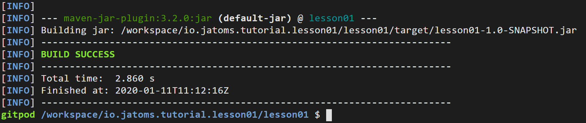
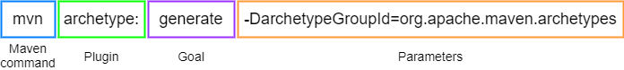

## Abstract
In this tutorial we will first create a Java "Hello World" application with Maven and then, piece by piece, add stuff to make this Java porject an OSGi project.
During these steps background knowledge is provided to understand what we did in each step.
Each step first contains a set of instructions that you can follow and afterwards a set of epxlanations, that describe what each instructions does.

## Step 01 - Create a simple Java application with Maven
[](https://gitpod.io#https://github.com/jatoms-io/io.jatoms.tutorial.lesson01/tree/step-01)
### Instructions
#### Lets create a new Java project: 
* In the command line type `mvn archetype:generate -DarchetypeGroupId=org.apache.maven.archetypes -DarchetypeArtifactId=maven-archetype-quickstart -DarchetypeVersion=1.4`
* When asked for a groupId type `io.jatoms`, 
* When asked for an archetypeId type `lesson01`
* When asked for a version/package just take the defaults by hitting enter 
* Your file explorer on the left now should show something like this: 


#### Lets create an executable JAR:
* Open the file `lesson01/pom.xml` and replace the `<pluginManagement>...</pluginManagement>` section with the following snippet:

```xml
<plugins>
    <plugin>
        <!-- Build an executable JAR -->
        <groupId>org.apache.maven.plugins</groupId>
        <artifactId>maven-jar-plugin</artifactId>
        <version>3.2.0</version>
        <configuration>
            <archive>
                <manifest>
                    <mainClass>io.jatoms.App</mainClass>
                </manifest>
            </archive>
        </configuration>
    </plugin>
</plugins>
```

* Don't forget to save your pom.xml file
* In your terminal type `cd lesson01` -> enter -> type `mvn package` -> enter
* After downloading the internet maven should display something like this

  
#### Run Hello World:
* In your terminal type `java -jar target/lesson01-1.0-SNAPSHOT.jar`
* Be awestruck by your majestic "Hello World" on the commandline ;)

### Explanations
In this section we will have a detailed look at each instruction from above. 
For a more experienced Java developer this might become boring, so feel free to skip the explanations if there's nothing new in them for you ;)

#### First Instruction
First we will dissect the Maven command we used to create the project and also learn what Maven is in the first place.
Below you see a picture that breaks down this command in its different parts:


Via the `mvn` command we advised Maven to execute the `generate` goal of the `archetype` plugin to use the provided parameters for finding and downloading a Maven archetype from Maven Central that is then used to create a simple Java project for us.

...

Phew! Quite a lot to digest in that sentence. If you are not familiar with Maven you might now wonder: 
* "What is an archetype?"
* "What is a goal?"
* "... a plugin?" 
* "... Maven Central?"
* "Maven coordi-what?"
* and "WTF is Maven?"

Don't be afraid! We will answer each of these questions in the section below. 
We first will see what Maven is, then what plugins and their goals are, how Maven coordinates fit into this picture and also what an archetype is.

If you have ever worked with Maven before you can probably guess what is going on behind the curtain, but for those not familiar with Maven: Here comes the lenghty explanation!

##### What is Maven and what did we do with it?
> Maven is, at its core, a plugin execution framework.

When you installed Maven (Well actually we installed it for you if you are using GitPod) then it already comes bundled with some plugins that are usually needed by Maven users.
The `archetype` plugin is one of those. This plugin provides goals that can be used to generate project from archetype which  is often used to bootstrap a project, i.e., you don't need to create folders and files by yoursefl each time you start a new project. 

##### What is a plugin and what are goals?

> Plugins are just usual Java Jars.

Maven plugin Jars should be named according to the Maven naming convention, e.g., `hello-maven-plugin`, where `hello` is the name of your plugin.

As plugins are plain old Java Jars, they contain classes, which can be plugin goals. 
In order for a class to be a goal it has to be annotated with the `@Mojo` anntoation. 
It can also extend `AbstractMojo`, but this parent class just provides you with additional helper stuff and is not mandatory.  
Finally, the class has to implement an `execute` method which is called by Maven when it is advised to execute this goal of your plugin.

To sum it up:
> A goal ist a Java class annotated with `@Mojo` and an `execute` method.

Below you can see an example goal that is taken from the official Maven website:

```java 
@Mojo( name = "sayhi")
public class GreetingMojo extends AbstractMojo
{
    public void execute() throws MojoExecutionException
    {
        getLog().info( "Hello, world." );
    }
}
```

Up until now we have explained what this part `mvn archetype:generate` of the above used command does, i.e., advise maven to execute the goal `generate` of the plugin `archetyoe`.
But what about the rest of the command, the part with `-DarchetypeGroupId=... -DarchetypeArtifactId=... - DarchetypeVersion=...`?

Well, goals can have parameters that provide them with a little bit more context about their execution and what exactly they should do.
If we adapted the above shown example goal `sayhi` a little bit more to the goal `generate` that we used in our command, then it would look like this:

```java
@Mojo( name = "generate")
public class OurGenerationMojo extends AbstractMojo
{
    @Parameter( property = "generate.archetypeGroupId" )
    private String groupId;

    @Parameter( property = "generate.archetypeArtifactId" )
    private String artifactId;

    @Parameter( property = "generate.archetypeVersion" )
    private String version;

    public void execute() throws MojoExecutionException
    {
        downloadArchetypeFromMavenCentral(groupId, artifactId, version);
        generateProjectFromArchetype();
    }
}
```
You can see that the provided parameters `archetypeGroupId`, `archetypeArtifactId` and `archetypeVersion` are just Maven coordinates that are used to find the archetype on Maven central and download it, which finally leads us to the question:

##### What are Maven coordinates, Maven Central and Maven archetypes

> Maven coordinates are unique identifiers for Jars, consisting of a `groupId`, an `artifactId` and a `version`

Usually you see those coordinates given in the pom.xml for dependencies your project needs or plugins that you want to use, so usually a Maven coordinate looks like this:

```xml
<groupId>my.domain</groupId>
<aritfactId>my.artifact</artifactId>
<version>1.2.3</version>
```

A Maven coordinate in itself is quite useless, as it is just an identifier. What actually makes this useful is Maven Central (and other artifact repositories)

> Maven Central is basically a giant database for Jars

As each Jar in Maven Central has a Maven coordinate, it can be loacted and downloaded by tools that understand those coordinates.
One of these tools is the `archetype` plugin that we used to generate our project. 
It takes the provided Maven coordinates, asks Maven Central for the Jar identified by these coordinates, downloads it and uses its contents to create a Java project for us.

This leads us to the last missing piece of our Maven puzzle: Maven archetypes.

> A Maven archetype is a Jar containing the blueprint for files and folders 

Usually this is used for a project structure, but can also be used for other things.
The files and folders are not all statically named, but often have a placeholder as a name, so that a user can provide names for them, like we did when we provided `io.jatoms` as `package` for the archetype.
This package name was then used by the archetype to fill in the placeholder it has in its `App.java` file:
```java 
package $package;

/**
 * Hello world!
 *
 */
public class App 
{
    public static void main( String[] args )
    {
        System.out.println( "Hello World!" );
    }
}
```

So to summarize what this line `mvn archetype:generate -DarchetypeGroupId=... -DarchetypeArtifactId=... -DarchetypeVersion=...` did:
* Tell Maven to execute the generate goal of the archetype plugin and provide Maven coordinates that identify the archetype we want to use 
* The goal then asks Maven Central for the archetype Jar at the given coordinates, downloads it and uses it to generate the project for us with the placeholder names we provided.

#### Second instruction 

Now that we understand what happened during project setup, we will have a look at what we did to make an executable Jar.

We first changed the content of the pom.xml file located at the root of our lesson01 project folder. This might lead to the question: 

##### What is the pom.xml file?

In short: 

> A pom.xml file is a configuration file that lets you configure Maven

However, this explanation is a little bit abstract. Of course, you now know that you can configure Maven, but what does this actually mean and what at all can I configure?


* Then we adviced maven to package our application 
    * what are maven phases?
    * what did this do? -> look into target folder -> download jar. -> use 7zip or similar to open and have a look at contents, especially Manifest.MF file 


### Further reading
If you are interested in more in-depth knowledge about the stuff you just read then follow these links:
* [Maven Central, the giant database containing all the Jars your heart desires](https://mvnrepository.com/repos/central)
* [How to write your own Maven plugin](https://maven.apache.org/guides/plugin/guide-java-plugin-development.html)
* [How to create your own Maven archetype](https://maven.apache.org/guides/mini/guide-creating-archetypes.html)

## Step 02 - Make your application OSGi compatible
**Instructions**
* open pom.xml -> add 
```xml
<build>
    <plugins>
        <!-- Use the bnd-maven-plugin and assemble the symbolic names -->
        <plugin>
            <groupId>biz.aQute.bnd</groupId>
            <artifactId>bnd-maven-plugin</artifactId>
            <version>4.3.0</version>
            <configuration>
                <bnd><![CDATA[
    Bundle-SymbolicName: ${project.groupId}.${project.artifactId}
    -sources: true
    -contract: *
    ]]></bnd>
            </configuration>
            <executions>
                <execution>
                    <goals>
                        <goal>bnd-process</goal>
                    </goals>
                </execution>
            </executions>
        </plugin>
        <!-- Required to make the maven-jar-plugin pick up the bnd 
            generated manifest. Also avoid packaging empty Jars -->
        <plugin>
            <groupId>org.apache.maven.plugins</groupId>
            <artifactId>maven-jar-plugin</artifactId>
            <version>3.0.2</version>
            <configuration>
                <archive>
                    <manifestFile>${project.build.outputDirectory}/META-INF/MANIFEST.MF</manifestFile>
                </archive>
                <skipIfEmpty>true</skipIfEmpty>
            </configuration>
        </plugin>
    </plugins>
</build>
```
* in terminal type `mvn package` -> hit enter

**Explanations**
* What are maven plugins?
* What does the bnd-maven-plugin do?
    * Why is the maven-jar-plugin instruction needed?
* what did this do? -> look into target folder -> download jar. -> use 7zip or similar to open and have a look at contents, especially Manifest.MF file and OSGi-OPT
* What do the entries in the Manifest mean? 
* What is OSGi from a Java developer's perspective?
    * a Framework with a runtime 
    * centered around three main ideas
        * modules that state what they need and provide (assembled at build/runtime by an external tool based on these informations)
        * services to enable interaction between modules 
        * dynamism


**Old outline**
* Starting with an empty workspace (Gitpod should have all necessary tools set up, snippets unfortunately not working yet)
* Use Maven archetype to create a simple plain Java Hello World Application
* demonstrate everything works fine
* show manifest file
* add bnd-maven plugin to project 
* show manifest file again
* show that the plain java application still works 
* add necessary bnd-maven plugins to project to create a runnable osgi "fat jar"
* now start OSGi framework with this bundle installed and that this still "works" (no error message, but also no ouput, as the main method will not be invoked)
* explain what OSGi is (Part 1), 
    * framework on top of JVM
    * wants Jars with proper manifests and calls them bundles 
* show what manifest entries are necessary to work within OSGi and show that our bundle has those entries 