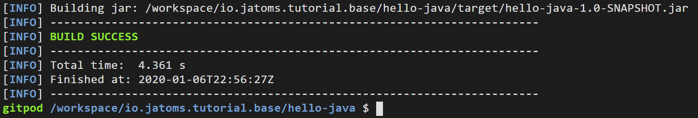

## Abstract
In this tutorial we will first create a good old Java8 Hello World application with Maven and then piece by piece add stuff to make it OSGi compatibel.

## Step 01 - Create a Java 8 "Hello World" application with Maven
**Instructions**
* create new java8 project 
  * ctrl + shift + p -> type `maven` and choose `maven: Create Maven Project` -> select `More..` -> type `java8` -> select `javase8-essentials-archetype` -> select 2.0 -> select root folder `io.jatoms.tutorial.lesson01`
  * groupId: io.jatoms, archetypeId: hello-java, version -> default: hit enter, package: default -> hit enter -> enter 
  * in folder `hello-java/src/main/java` create new file `io/jatoms/Hello.java`
  * open `Hello.java` (wait for language server to start) -> type `class` -> hit `ctrl + space` -> select `class` with a square symbol in front of it -> type `main` -> hit enter
  * In you main method type `syso` -> hit `ctrl + enter` and complete your sysout with `"Hello Java!"`
* test if everything is correct
  * in your terminal type `cd hello-java` -> enter -> type `mvn package` -> enter
  * after downloading the internet maven should display something like this
  

**Explanations**
* First we adviced maven to create a new project from an archetype 
    * what is maven?
    * what is an archetype?
* Then we adviced maven to package our application 
    * what are maven phases?
    * what did this do? -> look into target folder -> download jar. -> use 7zip or similar to open and have a look at contents, especially Manifest.MF file 

## Step 02 - Make your application OSGi compatible
**Instructions**
* open pom.xml -> add 
```xml
<build>
    <plugins>
        <!-- Use the bnd-maven-plugin and assemble the symbolic names -->
        <plugin>
            <groupId>biz.aQute.bnd</groupId>
            <artifactId>bnd-maven-plugin</artifactId>
            <version>4.3.0</version>
            <configuration>
                <bnd><![CDATA[
    Bundle-SymbolicName: ${project.groupId}.${project.artifactId}
    -sources: true
    -contract: *
    ]]></bnd>
            </configuration>
            <executions>
                <execution>
                    <goals>
                        <goal>bnd-process</goal>
                    </goals>
                </execution>
            </executions>
        </plugin>
        <!-- Required to make the maven-jar-plugin pick up the bnd 
            generated manifest. Also avoid packaging empty Jars -->
        <plugin>
            <groupId>org.apache.maven.plugins</groupId>
            <artifactId>maven-jar-plugin</artifactId>
            <version>3.0.2</version>
            <configuration>
                <archive>
                    <manifestFile>${project.build.outputDirectory}/META-INF/MANIFEST.MF</manifestFile>
                </archive>
                <skipIfEmpty>true</skipIfEmpty>
            </configuration>
        </plugin>
    </plugins>
</build>
```
* in terminal type `mvn package` -> hit enter

**Explanations**
* What are maven plugins?
* What does the bnd-maven-plugin do?
    * Why is the maven-jar-plugin instruction needed?
* what did this do? -> look into target folder -> download jar. -> use 7zip or similar to open and have a look at contents, especially Manifest.MF file and OSGi-OPT
* What do the entries in the Manifest mean? 
* What is OSGi from a Java developer's perspective?
    * a Framework with a runtime 
    * centered around three main ideas
        * modules that state what they need and provide (assembled at build/runtime by an external tool based on these informations)
        * services to enable interaction between modules 
        * dynamism


**Old outline**
* Starting with an empty workspace (Gitpod should have all necessary tools set up, snippets unfortunately not working yet)
* Use Maven archetype to create a simple plain Java Hello World Application
* demonstrate everything works fine
* show manifest file
* add bnd-maven plugin to project 
* show manifest file again
* show that the plain java application still works 
* add necessary bnd-maven plugins to project to create a runnable osgi "fat jar"
* now start OSGi framework with this bundle installed and that this still "works" (no error message, but also no ouput, as the main method will not be invoked)
* explain what OSGi is (Part 1), 
    * framework on top of JVM
    * wants Jars with proper manifests and calls them bundles 
* show what manifest entries are necessary to work within OSGi and show that our bundle has those entries 