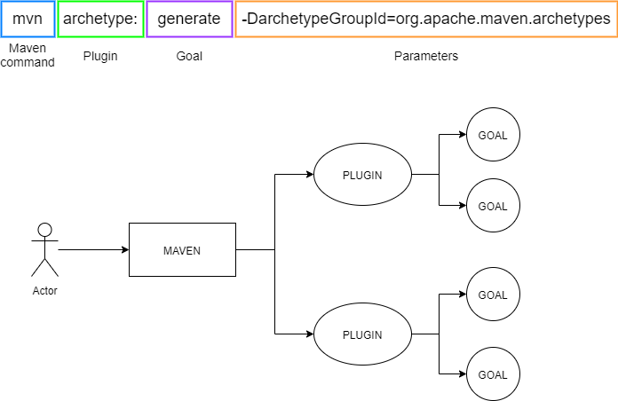

## Abstract
In this tutorial we will first create a Java "Hello World" application with Maven and then, piece by piece, add stuff to make this Java porject an OSGi project.
During these steps background knowledge is provided to understand what we did in each step.
Each step first contains a set of instructions that you can follow and afterwards a set of epxlanations, that describe what each instructions does.

## Step 01 - Create a simple Java "Hello World" application with Maven
### Instructions
[](https://gitpod.io#*https://github.com/jatoms-io/io.jatoms.tutorial.lesson01/tree/step-01)

#### Lets create a new Java project: 
* In the command line type `mvn archetype:generate -DarchetypeGroupId=org.apache.maven.archetypes -DarchetypeArtifactId=maven-archetype-quickstart -DarchetypeVersion=1.4`
* For groupId type `io.jatoms`, for archetypeId `lesson01`, for version just hit enter, for package also just hit enter -> enter 
* Your file explorer on the left now should show something like this: 


#### Lets create an executable JAR:
* Open the file `lesson01/pom.xml` and replace the `<pluginManagement>...</pluginManagement>` section with the following snippet:

```xml
<plugins>
    <plugin>
        <!-- Build an executable JAR -->
        <groupId>org.apache.maven.plugins</groupId>
        <artifactId>maven-jar-plugin</artifactId>
        <version>3.2.0</version>
        <configuration>
            <archive>
                <manifest>
                    <mainClass>io.jatoms.App</mainClass>
                </manifest>
            </archive>
        </configuration>
    </plugin>
</plugins>
```

* In your terminal type `cd lesson01` -> enter -> type `mvn package` -> enter
* After downloading the internet maven should display something like this

  
#### Run Hello World:
* In your terminal type `java -jar target/lesson01-1.0-SNAPSHOT.jar`
* Be awestruck by your majestic "Hello World" on the commandline ;)

### Explanations
In this section we will have a look at each instruction stated above in detail. 
For a more experienced Java developer this might become boring, so feel free to skip the explanations if there's nothing new for you ;)

So let's now have a detailed look at each instruction we executed, starting with 
```md
* In the command line type `mvn archetype:generate -DarchetypeGroupId=org.apache.maven.archetypes -DarchetypeArtifactId=maven-archetype-quickstart -DarchetypeVersion=1.4`
* For groupId type `io.jatoms`, for archetypeId `lesson01`, for version just hit enter, for package also just hit enter -> enter 
```
If you have ever worked with Maven before you can probably guess what is going on behind the curtain, but for those not familiar with Maven: Here comes a lenghty explanation!

#### What is Maven and what did we do with it?
Maven is, at its core, a plugin execution framework.
By following the instructions stated above we we advised maven via the `mvn` command to execute the `generate` goal of the `archetype` plugin to generate a simple Java project,
by providing the Maven coordinates (archetypeGroupId, archetypeArtifactId, archetypeVersion) of the archetype we want to use.

So what is a plugin, what are goals and what is an archetype?

Plugins are Jars that contain classes which can be goals (or just helper classes for those goals). 
Each goal is usually annotated with a `@Mojo` annotation (I think this stands for "Maven plain old Java object") and have an execute method that can be called by Maven:

```java 
@Mojo( name = "sayhi")
public class GreetingMojo extends AbstractMojo
{
    public void execute() throws MojoExecutionException
    {
        getLog().info( "Hello, world." );
    }
}
```
The image below just shows grpahically how a Maven command usually looks like and how Maven is logically structured.



Regarding Maven coordinates and archetypes:

Maven coordinates can be seen as a unique identifier that consists of a `groupId`, an `artifactId` and a `version` which are usually given in this format:

```xml
<groupId>my.domain</groupId>
<aritfactId>my.artifact</artifactId>
<version>1.2.3</version>
```

Those coordinates are heavily used in [Maven Central](https://mvnrepository.com/repos/central) which is just a giant database for Jars and other Java things that you can use in your project. 
Here the Maven coordinates are usually used to find the thing you want, for example an archetype that you want to use to create a project.
The archetype we used is also stored in this giant database: [See here](https://search.maven.org/search?q=g:org.apache.maven.archetypes%20AND%20a:maven-archetype-quickstart)

So what is an archetype? 

An archetype is really nothing more than a Jar that contains the same folder and file structure that we want to generate, however some names are placeholder for input values provided by the user during the archetype generation.
The package name we provided during archetype generation is such a placeholder, which is then filled in the App.java file like this
```java 
package $package;

/**
 * Hello world!
 *
 */
public class App 
{
    public static void main( String[] args )
    {
        System.out.println( "Hello World!" );
    }
}
```

So to summarize what this line `mvn archetype:generate -DarchetypeGroupId=org.apache.maven.archetypes -DarchetypeArtifactId=maven-archetype-quickstart -DarchetypeVersion=1.4` did:
* Tell Maven to execute the archetype plugin with the generate goal and the Maven coordinates for our archetype 
* The plugin then asks Maven Central for the Jar at the given coordinates, dwonloads it and uses it to generate the project for us.


* Then we adviced maven to package our application 
    * what are maven phases?
    * what did this do? -> look into target folder -> download jar. -> use 7zip or similar to open and have a look at contents, especially Manifest.MF file 

## Step 02 - Make your application OSGi compatible
**Instructions**
* open pom.xml -> add 
```xml
<build>
    <plugins>
        <!-- Use the bnd-maven-plugin and assemble the symbolic names -->
        <plugin>
            <groupId>biz.aQute.bnd</groupId>
            <artifactId>bnd-maven-plugin</artifactId>
            <version>4.3.0</version>
            <configuration>
                <bnd><![CDATA[
    Bundle-SymbolicName: ${project.groupId}.${project.artifactId}
    -sources: true
    -contract: *
    ]]></bnd>
            </configuration>
            <executions>
                <execution>
                    <goals>
                        <goal>bnd-process</goal>
                    </goals>
                </execution>
            </executions>
        </plugin>
        <!-- Required to make the maven-jar-plugin pick up the bnd 
            generated manifest. Also avoid packaging empty Jars -->
        <plugin>
            <groupId>org.apache.maven.plugins</groupId>
            <artifactId>maven-jar-plugin</artifactId>
            <version>3.0.2</version>
            <configuration>
                <archive>
                    <manifestFile>${project.build.outputDirectory}/META-INF/MANIFEST.MF</manifestFile>
                </archive>
                <skipIfEmpty>true</skipIfEmpty>
            </configuration>
        </plugin>
    </plugins>
</build>
```
* in terminal type `mvn package` -> hit enter

**Explanations**
* What are maven plugins?
* What does the bnd-maven-plugin do?
    * Why is the maven-jar-plugin instruction needed?
* what did this do? -> look into target folder -> download jar. -> use 7zip or similar to open and have a look at contents, especially Manifest.MF file and OSGi-OPT
* What do the entries in the Manifest mean? 
* What is OSGi from a Java developer's perspective?
    * a Framework with a runtime 
    * centered around three main ideas
        * modules that state what they need and provide (assembled at build/runtime by an external tool based on these informations)
        * services to enable interaction between modules 
        * dynamism


**Old outline**
* Starting with an empty workspace (Gitpod should have all necessary tools set up, snippets unfortunately not working yet)
* Use Maven archetype to create a simple plain Java Hello World Application
* demonstrate everything works fine
* show manifest file
* add bnd-maven plugin to project 
* show manifest file again
* show that the plain java application still works 
* add necessary bnd-maven plugins to project to create a runnable osgi "fat jar"
* now start OSGi framework with this bundle installed and that this still "works" (no error message, but also no ouput, as the main method will not be invoked)
* explain what OSGi is (Part 1), 
    * framework on top of JVM
    * wants Jars with proper manifests and calls them bundles 
* show what manifest entries are necessary to work within OSGi and show that our bundle has those entries 