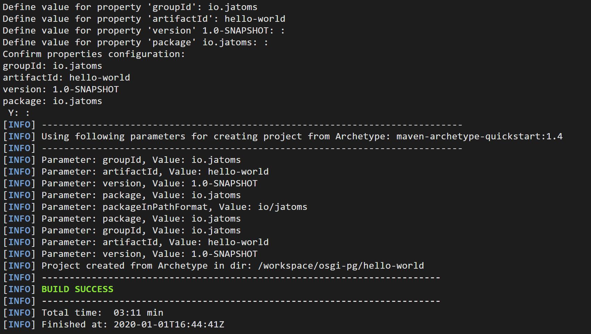
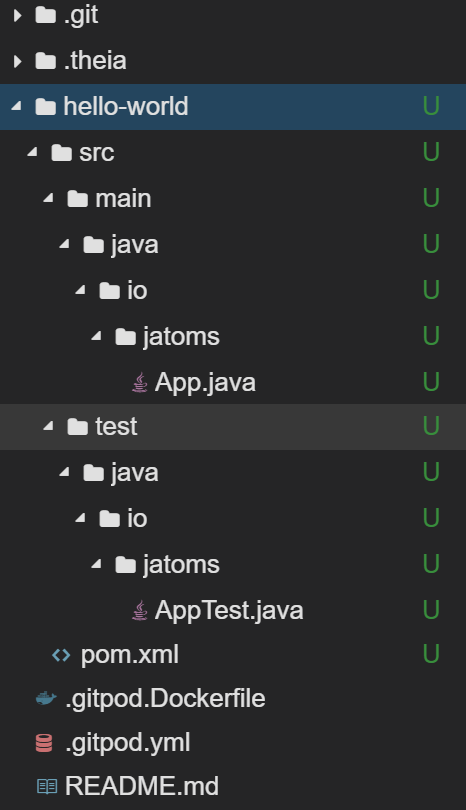

In this lesson we will start with a good old "Hello World" java application and then, step by step, "OSGify" this application.

This tutorial will contain everything necessary for you to understand what is going on in the background and why the things in OSGi are as they are. 
The only thing that is assumed as prerequisite is knowledge about Java as a language, so you need to know how for-loops, if-else-statements and stuff like this are working, but nothing more.
If you are a more advanced reader, then it's up to you to skip the parts that only contain stuff you already know, e.g., about maven, classloading or stuff like that.

As it is the first tutorial in a series it will be a little bit longer, as we need to explain some basics, that we assume to be known in later lessons.

An executable workspace where you can try the stuff shown in this lesson can be found here: (TODO)

So let's begin and create our excitingly boring "Hello World" application.
Boring because you've probably created a lot of them by now and excitingly because you still can learn so much about frameworks/languages out of them if you are dissecting them piuce by piece.

The first thing you should do is go to our prepared [GitPod](TODO: add link to GitPod explanation) workspace, switch to the terminel (CTRL+Ö) and type `mvn archetype:generate -DarchetypeGroupId=org.apache.maven.archetypes -DarchetypeArtifactId=maven-archetype-quickstart -DarchetypeVersion=1.4`
This command will tell maven to generate a project for you in the folder that you are currently in. 
For this maven asks you to insert a groupId, artifactId and a version. 
You can enter whatever you want, but by convention you usally insert a reverted domain of yours as groupId, for me that would be `io.jatoms`, as artifactId we pick `hello-world` and the rest maven asks us for we just use the defaults by pressing enter, until maven shows us an output like depicted below.

What maven did here was to create a folder and structure that adheres to the default layout for maven Java projects and should look like this: 

* Starting with an empty workspace (Gitpod should have all necessary tools set up, snippets unfortunately not working yet)
* Use Maven archetype to create a simple plain Java Hello World Application
* demonstrate everything works fine
* show manifest file
* add bnd-maven plugin to project 
* show manifest file again
* show that the plain java application still works 
* add necessary bnd-maven plugins to project to create a runnable osgi "fat jar"
* now start OSGi framework with this bundle installed and that this still "works" (no error message, but also no ouput, as the main method will not be invoked)
* explain what OSGi is (Part 1), 
    * framework on top of JVM
    * wants Jars with proper manifests and calls them bundles 
* show what manifest entries are necessary to work within OSGi and show that our bundle has those entries 