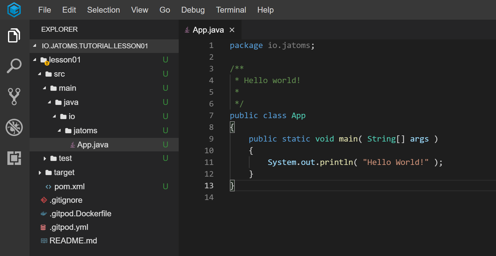

## Abstract
In this tutorial we will first create a Java "Hello World" application with Maven and then, piece by piece, add stuff to make this Java porject an OSGi project.
During these steps background knowledge is provided to understand what we did in each step.
Each step first contains a set of instructions that you can follow and afterwards a set of epxlanations, that describe what each instructions does.

## Step 01 - Create a simple Java application with Maven
[](https://gitpod.io#https://github.com/jatoms-io/io.jatoms.tutorial.lesson01/tree/step-01)
### Instructions


#### Lets create a new Java project: 
* In the command line type `mvn archetype:generate -DarchetypeGroupId=org.apache.maven.archetypes -DarchetypeArtifactId=maven-archetype-quickstart -DarchetypeVersion=1.4`
* When asked for a groupId type `io.jatoms`, 
* When asked for an archetypeId type `lesson01`
* When asked for a version/package just take the defaults by hitting enter 
* Your file explorer on the left now should show something like this: 



#### Lets create an executable JAR:
* Open the file `lesson01/pom.xml` and replace the `<pluginManagement>...</pluginManagement>` section with the following snippet:

```xml
<plugins>
    <plugin>
        <!-- Build an executable JAR -->
        <groupId>org.apache.maven.plugins</groupId>
        <artifactId>maven-jar-plugin</artifactId>
        <version>3.2.0</version>
        <configuration>
            <archive>
                <manifest>
                    <mainClass>io.jatoms.App</mainClass>
                </manifest>
            </archive>
        </configuration>
    </plugin>
</plugins>
```

* Don't forget to save your pom.xml file
* In your terminal type `cd lesson01` -> enter -> type `mvn package` -> enter
* After downloading the internet maven should display something like this

  

#### Inspect the generated MANIFEST.MF:
* Open the `target` folder and download `lesson01-1.0-SNAPSHOT.jar`
* Open the downloaded jar with 7zip 
* Navigate to `META-INF/MANIFEST.MF`
* Open MANIFEST.MF 
* You should see something like this:
```
Manifest-Version:1.0
Created-By: Maven Jar Plugin 3.2.0
Build-Jdk-Spec: 11
Main-Class: io.jatoms.App
```


#### Run Hello World:
* In your terminal type `java -jar target/lesson01-1.0-SNAPSHOT.jar`
* Be awestruck by your majestic "Hello World" on the commandline ;)


### Explanations
In this section we will have a detailed look at each instruction from above. 
For a more experienced Java developer this might become boring, so feel free to skip the explanations if there's nothing new in them for you ;)


#### First Instruction
First we will dissect the Maven command we used to create the project and also learn what Maven is in the first place.
Below you see a picture that breaks down this command in its different parts:


Via the `mvn` command we advised Maven to execute the `generate` goal of the `archetype` plugin to use the provided parameters for finding and downloading a Maven archetype from Maven Central that is then used to create a simple Java project for us.

...

Phew! Quite a lot to digest in that sentence. If you are not familiar with Maven you might now wonder: 
* "What is an archetype?"
* "What is a goal?"
* "... a plugin?" 
* "... Maven Central?"
* "Maven coordi-what?"
* and "WTF is Maven?"

Don't be afraid! We will answer each of these questions in the section below. 
We first will see what Maven is, then what plugins and their goals are, how Maven coordinates fit into this picture and also what an archetype is.

If you have ever worked with Maven before you can probably guess what is going on behind the curtain, but for those not familiar with Maven: Here comes the lenghty explanation!


##### What is Maven and what did we do with it?
> Maven is, at its core, a plugin execution framework.

When you installed Maven (Well actually we installed it for you if you are using GitPod) then it already comes bundled with some plugins that are usually needed by Maven users.
The `archetype` plugin is one of those. This plugin provides goals that can be used to generate project from archetype which  is often used to bootstrap a project, i.e., you don't need to create folders and files by yoursefl each time you start a new project. 


##### What is a plugin and what are goals?
> Plugins are just usual Java Jars.

Maven plugin Jars should be named according to the Maven naming convention, e.g., `hello-maven-plugin`, where `hello` is the name of your plugin.

As plugins are plain old Java Jars, they contain classes, which can be plugin goals. 
In order for a class to be a goal it has to be annotated with the `@Mojo` anntoation. 
It can also extend `AbstractMojo`, but this parent class just provides you with additional helper stuff and is not mandatory.  
Finally, the class has to implement an `execute` method which is called by Maven when it is advised to execute this goal of your plugin.

To sum it up:
> A goal ist a Java class annotated with `@Mojo` and an `execute` method.

Below you can see an example goal that is taken from the official Maven website:

```java 
@Mojo( name = "sayhi")
public class GreetingMojo extends AbstractMojo
{
    public void execute() throws MojoExecutionException
    {
        getLog().info( "Hello, world." );
    }
}
```

Up until now we have explained what this part `mvn archetype:generate` of the above used command does, i.e., advise maven to execute the goal `generate` of the plugin `archetyoe`.
But what about the rest of the command, the part with `-DarchetypeGroupId=... -DarchetypeArtifactId=... - DarchetypeVersion=...`?

Well, goals can have parameters that provide them with a little bit more context about their execution and what exactly they should do.
If we adapted the above shown example goal `sayhi` a little bit more to the goal `generate` that we used in our command, then it would look like this:

```java
@Mojo( name = "generate")
public class OurGenerationMojo extends AbstractMojo
{
    @Parameter( property = "generate.archetypeGroupId" )
    private String groupId;

    @Parameter( property = "generate.archetypeArtifactId" )
    private String artifactId;

    @Parameter( property = "generate.archetypeVersion" )
    private String version;

    public void execute() throws MojoExecutionException
    {
        downloadArchetypeFromMavenCentral(groupId, artifactId, version);
        generateProjectFromArchetype();
    }
}
```
You can see that the provided parameters `archetypeGroupId`, `archetypeArtifactId` and `archetypeVersion` are just Maven coordinates that are used to find the archetype on Maven central and download it, which finally leads us to the question:


##### What are Maven coordinates, Maven Central and Maven archetypes
> Maven coordinates are unique identifiers for Jars, consisting of a `groupId`, an `artifactId` and a `version`

Usually you see those coordinates given in the pom.xml for dependencies your project needs or plugins that you want to use, so usually a Maven coordinate looks like this:

```xml
<groupId>my.domain</groupId>
<aritfactId>my.artifact</artifactId>
<version>1.2.3</version>
```

A Maven coordinate in itself is quite useless, as it is just an identifier. What actually makes this useful is Maven Central (and other artifact repositories)

> Maven Central is basically a giant database for Jars

As each Jar in Maven Central has a Maven coordinate, it can be loacted and downloaded by tools that understand those coordinates.
One of these tools is the `archetype` plugin that we used to generate our project. 
It takes the provided Maven coordinates, asks Maven Central for the Jar identified by these coordinates, downloads it and uses its contents to create a Java project for us.

This leads us to the last missing piece of our Maven puzzle: Maven archetypes.

> A Maven archetype is a Jar containing the blueprint for files and folders 

Usually this is used for a project structure, but can also be used for other things.
The files and folders are not all statically named, but often have a placeholder as a name, so that a user can provide names for them, like we did when we provided `io.jatoms` as `package` for the archetype.
This package name was then used by the archetype to fill in the placeholder it has in its `App.java` file:
```java 
package $package;

/**
 * Hello world!
 *
 */
public class App 
{
    public static void main( String[] args )
    {
        System.out.println( "Hello World!" );
    }
}
```

So to summarize what this line `mvn archetype:generate -DarchetypeGroupId=... -DarchetypeArtifactId=... -DarchetypeVersion=...` did:
* Tell Maven to execute the generate goal of the archetype plugin and provide Maven coordinates that identify the archetype we want to use 
* The goal then asks Maven Central for the archetype Jar at the given coordinates, downloads it and uses it to generate the project for us with the placeholder names we provided.


#### Second instruction 
Now that we understand what happened during project setup, we will have a look at what we did to make an executable Jar.

We first changed the content of the pom.xml file located at the root of our lesson01 project folder. This might lead to the question: 


##### What is the pom.xml file?
In short: 

> A pom.xml file is a configuration file that lets you configure Maven

However, this explanation is a little bit abstract. Of course, you now know that you can configure Maven, but what does this actually mean and what at all can I configure?
So let's look at the parts of a pom.xml file that we are using here and what they are configuring.

First, a minimal pom.xml that you need to execute Maven successfully looks like this

```xml
<project>
  <modelVersion>4.0.0</modelVersion>
  <groupId>com.mycompany.app</groupId>
  <artifactId>my-app</artifactId>
  <version>1</version>
</project>
```

There's not much to this, as this pom.xml just provides the Maven coordinates of your project and the `modelVersion` which states the Project Object Model version that is used for this pom.xml.
The only thing you need to know about this is that Maven 1.x only works with pom.xmls that daclare `modelVersion` to be 3.0.0 and Maven 2.x/3.x (3.6.2 is the version at the time of writing) only works with pom.xmls that declare `modelVersion` to be 4.0.0.

The pom.xml can be kept so short because of two reasons:
* Maven is *convention over configuration* based 
* Maven comes with a Super POM from which all pom.xml files inherit 

Convention over configuration means developers are not required to create the whole build process by themselves. 
Developers do not have to define each configuration detail, as Maven provides sensible defaults for projects, for example a default folder structure which (for Java projects) always lookos like this:
```
root (project root folder)
|-- src 
    |-- main 
        |-- java (below this is your source code)
            |-- your 
                |-- package
        |-- resources (below this you can put files and stuff)
    |-- test 
        |-- java (below this is test source code)
            |-- your 
                |-- package
|-- target
    |-- classes (compiled class files end up here)
        |-- META-INF (contains meta information about this jar)
            |-- MANIFEST.MF 
    |-- yourjar-1.0.0-SNAPSHOT.jar (the created jar for your project)
```

The other reason we mentioned, the Super POM, defines all the necessary data needed for such a convention-based project to be build by Maven and looks in an abbreviated version like this:
```xml
<project>
  <modelVersion>4.0.0</modelVersion>
  ...
  <pluginRepositories>
    <pluginRepository>
      <id>central</id>
      <name>Central Repository</name>
      <url>https://repo.maven.apache.org/maven2</url>
      ...
    </pluginRepository>
  </pluginRepositories>
 
  <build>
    <directory>${project.basedir}/target</directory>
    <outputDirectory>${project.build.directory}/classes</outputDirectory>
    <finalName>${project.artifactId}-${project.version}</finalName>
    <testOutputDirectory>${project.build.directory}/test-classes</testOutputDirectory>
    <sourceDirectory>${project.basedir}/src/main/java</sourceDirectory>
    <scriptSourceDirectory>${project.basedir}/src/main/scripts</scriptSourceDirectory>
    <testSourceDirectory>${project.basedir}/src/test/java</testSourceDirectory>
    <resources>
      <resource>
        <directory>${project.basedir}/src/main/resources</directory>
      </resource>
    </resources>
    <testResources>
      <testResource>
        <directory>${project.basedir}/src/test/resources</directory>
      </testResource>
    </testResources>
    ...
  </build>
  ...
</project>
```
We can see now where Maven got its information which repository to search when it needs a plugin that it doesn't have yet locally, i.e., `https://repo.maven.apache.org/maven2`.
We also can see that the Super POM provides Maven with a set of properties like `sourceDirectory` or `outputDirectory` which Maven needs during a build in order to know where to take the source code from and where to put a final jar file into.
For most of these properties Maven uses another property called `project.basedir` which is always the directory where the project pom.xml file lies in.

Now that we know where Maven gets most of its basic build information from, we turn back to our own pom.xml file.

##### Executable Jars
The part of the pom.xml we touched during the tutorial is the `build` section, which, as the name already implies, configures what Maven shoudl do during the build of our project.
To this `build` section we added a `plugin` called `maven-jar-plugin` and provided a property called `archive.manifest.mainClass` via a configuration as depicted below:

```xml
<plugins>
    <plugin>
        <groupId>org.apache.maven.plugins</groupId>
        <artifactId>maven-jar-plugin</artifactId>
        <version>3.2.0</version>
        <configuration>
            <archive>
                <manifest>
                    <mainClass>io.jatoms.App</mainClass>
                </manifest>
            </archive>
        </configuration>
    </plugin>
</plugins>
```
What this does is it tells Maven to include this plugin during a build and hand it over the parameter we defined.
The parameter is the fully qualified class name of the class in our project that has a main method in it.

#### Third Instruction
In order to see the result of including this plugin just go to the `target` folder of your project, download the file `lesson01-1.0-SNAPSHOT.jar` and open it with a zip program, e.g., 7zip.
What you will see is a folder structure like this:
```
lesson01-1.0-SNAPSHOT.jar 
|-- io (contains your class files)
|-- META-INF (contains meta information about this jar)
    |-- maven (contains pom.xml)
    |-- MANIFEST.MF (the manifest we generated) 
```

Now open the `MANIFEST.MF` file to have a look at it.
You should see something like this:

```
Manifest-Version:1.0
Created-By: Maven Jar Plugin 3.2.0
Build-Jdk-Spec: 11
Main-Class: io.jatoms.App
```

There is some information about the manifest version, how it was created (by our maven-jar plugin), which jdk we used to compile it and most importantly the fully qualified path to the class that has a main method.
This is all that is needed by the Java Virtual Machine (JVM) to execute our jar.
Without this entry, the JVM would not know where to search for a main method and would not execute our jar.

Now that we know why we added the maven-jar-plugin and what an executable jar actually is, let's take one step back and have a look at the command we used to create the jar: `mvn package`


##### Maven build lifecycle and its phases
As you probably noticed, we did not explicitly call any goal of the maven-jar-plugin, however maven was still able to execute something.
It seems the syntax on how to advise maven to do something still has some surprises up its sleves.

Instead of explicitly advising maven to execute the goal of a specific plugin, `maven package` advises maven to execute all phases of its build lifecycle up until the `package` phase is finished.
Now you might ask:
* What is the maven build lifecycle? 
* Or what are lifecycle phases?

> The Maven build lifecycle is a predefined process for building and distributing a particular artifact (project).
This process consists of different steps that are executed one after another and such a step is called a lifecycle phase.

The complete default maven build lifecycle, taken from the official maven site, has the following phases:

| Phase | Description |
| ----- | ----- |
| validate | validate the project is correct and all necessary information is available. | 
| initialize | initialize build state, e.g. set properties or create directories. | 
| generate-sources | generate any source code for inclusion in compilation. | 
| process-sources | process the source code, for example to filter any values. | 
| generate-resources | generate resources for inclusion in the package. | 
| process-resources | copy and process the resources into the destination directory, ready for packaging. | 
| compile | compile the source code of the project. | 
| process-classes | post-process the generated files from compilation, for example to do bytecode enhancement on Java classes. | 
| generate-test-sources | generate any test source code for inclusion in compilation. | 
| process-test-sources | process the test source code, for example to filter any values. | 
| generate-test-resources | create resources for testing. | 
| process-test-resources | copy and process the resources into the test destination directory. | 
| test-compile | compile the test source code into the test destination directory | 
| process-test-classes | post-process the generated files from test compilation, for example to do bytecode enhancement on Java classes. For Maven 2.0.5 and above. | 
| test | run tests using a suitable unit testing framework. These tests should not require the code be packaged or deployed.  | 
| prepare-package | perform any operations necessary to prepare a package before the actual packaging. This often results in an unpacked, processed version of the package. (Maven 2.1 and above) | 
| package | take the compiled code and package it in its distributable format, such as a JAR. | 
| pre-integration-test | perform actions required before integration tests are executed. This may involve things such as setting up the required environment. | 
| integration-test | process and deploy the package if necessary into an environment where integration tests can be run. | 
| post-integration-test | perform actions required after integration tests have been executed. This may including cleaning up the environment. | 
| verify | run any checks to verify the package is valid and meets quality criteria. | 
| install | install the package into the local repository, for use as a dependency in other projects locally. | 
| deploy | done in an integration or release environment, copies the final package to the remote repository for sharing with other developers and projects. |

As we can see, up until `package` there are quite some other phases that will get executed. 
However, the phases alone still do not explain, why the maven-jar-plugin has been executed at all.


##### Binding goals to phases
The last missing link is to know, that each plugin can bind goals to a phase.
That means, as soons as a plugin, which has bound one or more of its goals to a phase by default, is added to the build, by defining it in the `build` section, its bound goals will be executed as long as the phase to which they are bound is executed.
As the maven-jar-plugin by default binds its goal to the generate-resource phase which comes before the package phase it is called althoug we merely used the command `maven package`.


##### Fourth instruction
###### Executing an executable JAR
The last thing we did in this step was to execute the jar that was generated by our `maven package` command.
For this we used the command `java -jar target/lesson01-1.0-SNAPSHOT.jar` which tells the JVM to execute this jar. 
The JVM then takes that JAR looks for a manifest file at the location `META-INF/MANIFEST.MF` and uses the `Main-Class` entry to locate the class within the jar that has the main method in it.
Finally, this method is executed by the JVM and "Hello World" is printed out on the console.


### Further reading
If you are interested in more in-depth knowledge about the stuff you just read then follow these links:
* [Maven Central, the giant database containing all the Jars your heart desires](https://mvnrepository.com/repos/central)
* [How to write your own Maven plugin](https://maven.apache.org/guides/plugin/guide-java-plugin-development.html)
* [How to create your own Maven archetype](https://maven.apache.org/guides/mini/guide-creating-archetypes.html)
* [Introduction to the POM](https://maven.apache.org/guides/introduction/introduction-to-the-pom.html) 
* [Maven build lifecycle](https://maven.apache.org/guides/introduction/introduction-to-the-lifecycle.html)

## Step 02 - Turn your JAR into a bundle

**Outline**
* Use maven bundle plugin instead of jar 
    * Explanations: 
        * execution -> new packaging type , what are packaging types?
* Try to run it with old commands -> does not work
    * Explanation:
        * Inspect manifest -> no Main-Class
        * explain difference between bundle / jar
            * additional metadata


### Abstract 
In this step you will turn your Hello World JAR into a valid OSGi bundle. 
We then will have a look at what a bundle is in contrast to a plain JAR.

### Instructions

#### Let's turn our JAR into a bundle
* open your pom.xml -> replace the maven-jar-plugin entry with this one

```xml
<plugin>
    <groupId>org.apache.felix</groupId>
    <artifactId>maven-bundle-plugin</artifactId>
    <version>4.2.1</version>
    <extensions>true</extensions>
</plugin>   
```
* At the top of your pom.xml add `<packaging>bundle</packaging>` so that your project description looks like this:

```xml
<groupId>io.jatoms</groupId>
<artifactId>lesson01</artifactId>
<version>1.0-SNAPSHOT</version>
<packaging>bundle</packaging>
```

* In the terminal type `mvn clean package` and hit enter


#### Let's try to run the bundle
* Try to run your application as before with `java -jar target/lesson01-1.0-SNAPSHOT.jar`.
    * You will probably get the following error message: `no main manifest attribute, in target/lesson01-1.0-SNAPSHOT.jar`


#### Inspect the manifest
* Go to your `target` folder, download `lesson01-1.0-SNAPSHOT.jar` and open it with 7zip
* Navigate to `META-INF/MANIFEST.MF` and open it.
* You should see something like this:
```
Manifest-Version: 1.0
Bnd-LastModified: 1579456064945
Build-Jdk: 11.0.2
Built-By: gitpod
Bundle-ManifestVersion: 2
Bundle-Name: lesson01
Bundle-SymbolicName: io.jatoms.lesson01
Bundle-Version: 1.0.0.SNAPSHOT
Created-By: Apache Maven Bundle Plugin
Export-Package: io.jatoms;version="1.0.0"
Require-Capability: osgi.ee;filter:="(&(osgi.ee=JavaSE)(version=1.7))"
Tool: Bnd-4.2.0.201903051501
``` 
* Can you spot the missing piece?

### Explanations 

#### First Instruction

##### Maven-Bundle-Plugin 
The first thing we did was to replace the maven-jar-plugin with the maven-bundle-plugin in order to generate a bundle during our build instead of a jar.
The maven-bundle-plugin participates in the maven build lifecycle the same way as the maven-jar-plugin does. 
The only real difference between those two plugins is that the maven-bundle-plugin does not need any additional configuration but instead an `<extension>true</extension>` section is added.
This section tells Maven that this plugin provides so called Maven extension, e.g., packaging handlers as the one we need for our packaging type `bundle`.


* open your pom.xml -> replace the maven-jar-plugin entry with this one

```xml
<plugin>
    <groupId>org.apache.felix</groupId>
    <artifactId>maven-bundle-plugin</artifactId>
    <version>4.2.1</version>
    <extensions>true</extensions>
</plugin>   
```
* At the top of your pom.xml add `<packaging>bundle</packaging>` so that your project description looks like this:

```xml
<groupId>io.jatoms</groupId>
<artifactId>lesson01</artifactId>
<version>1.0-SNAPSHOT</version>
<packaging>bundle</packaging>
```

* In the terminal type `mvn clean package` and hit enter


## Step 03 - Make your Hello World run in OSGi 
* Add BundleActivator + activate method 
    * Explanations:
        * How to run code in a bundle?
            * needs to be loaded into a larger framework that executes it
            * needs some sort of entrypoint for the framework 


**Old outline**
* Starting with an empty workspace (Gitpod should have all necessary tools set up, snippets unfortunately not working yet)
* Use Maven archetype to create a simple plain Java Hello World Application
* demonstrate everything works fine
* show manifest file
* add bnd-maven plugin to project 
* show manifest file again
* show that the plain java application still works 
* add necessary bnd-maven plugins to project to create a runnable osgi "fat jar"
* now start OSGi framework with this bundle installed and that this still "works" (no error message, but also no ouput, as the main method will not be invoked)
* explain what OSGi is (Part 1), 
    * framework on top of JVM
    * wants Jars with proper manifests and calls them bundles 
* show what manifest entries are necessary to work within OSGi and show that our bundle has those entries 
* What is OSGi from a Java developer's perspective?
    * a Framework with a runtime 
    * centered around three main ideas
        * modules that state what they need and provide (assembled at build/runtime by an external tool based on these informations)
        * services to enable interaction between modules 
        * dynamism
